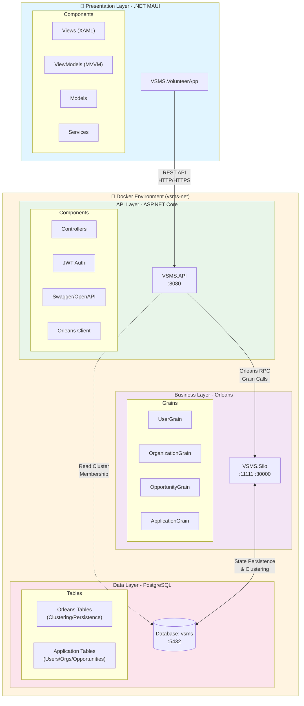

``` shell
VSMS (Volunteer Service Management System)
├── Backend
│   ├── VSMS.Grains.Interfaces
│   ├── VSMS.Grains  
│   ├── VSMS.API
│   ├── VSMS.Silo
│   └── VSMS.SQL
└── Frontend
    └── VSMS.VolunteerApp
        ├── Models
        ├── Views
        ├── ViewModels
        ├── Services
        └── Platforms
            ├── Android
            ├── iOS
            ├── MacCatalyst
            └── Windows
```

## System Architecture



### Technology Stack

| Layer | Technology | Purpose |
|-------|-----------|---------|
| **Mobile** | .NET MAUI 10 | Cross-platform UI (iOS/Android/Windows) |
| **API** | ASP.NET Core 10 | REST API, JWT Authentication |
| **Business** | Orleans 10 | Distributed Actor Framework |
| **Data** | PostgreSQL or CockroachDB | Relational Database or NoSQL |
| **Orchestration** | Docker Compose | Container Management |

### Key Features

- **Orleans Clustering**: ADO.NET provider for distributed coordination
- **State Persistence**: Automatic grain state storage in PostgreSQL
- **Authentication**: JWT-based security for API endpoints


## Getting Started

### Prerequisites

- **Docker Desktop**: Install [Docker Desktop](https://www.docker.com/products/docker-desktop/) for your platform
- **.NET 10 SDK**: Required for local development (optional for Docker-only deployment)
- **PostgreSQL Client**: Optional, for direct database access

### Running the Application

#### On macOS / Linux

```bash
# Make script executable (first time only)
chmod +x docker_build.sh

# Build and run
./docker_build.sh
```

#### On Windows

Double-click `docker_build.bat` or run in Command Prompt:

```cmd
docker_build.bat
```

#### Manual Docker Compose Commands

```bash
# Build without cache
docker compose build --no-cache

# Create services
docker compose up -d

# More Docker Compose Commands as follows:

# View logs
docker compose logs

# Stop services
docker compose stop

# Start services
docker compose start

# Remove services
docker compose down
```

### Accessing the Application

Once the containers are running:

| Service | URL | Description |
|---------|-----|-------------|
| **API** | http://localhost:8080 | REST API endpoints |
| **Swagger UI** | http://localhost:8080/swagger | API documentation and testing |
| **PostgreSQL** | localhost:5432 | Database (user: `root`, password: `root123`, db: `vsms`) |

### Troubleshooting

**Port conflicts**:

- Ensure ports 8080, 5432, 11111, and 30000 are not in use by other applications