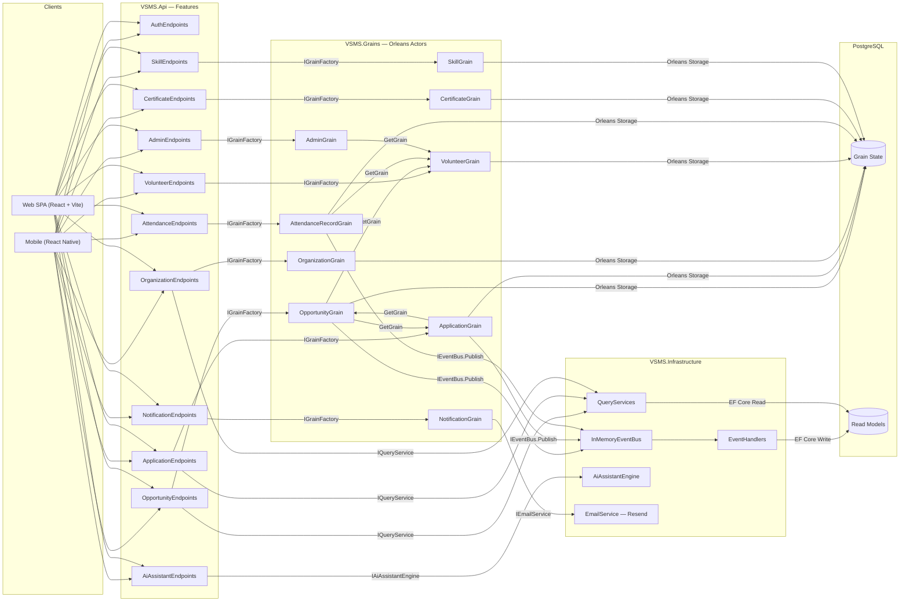

# VSMS System Module Architecture

## Module Call Topology

## Module Descriptions

| Module | Project | Role |
|---|---|---|
| **Mobile App** | `mobile/` | React Native + Expo cross-platform client with GPS, camera, push notifications |
| **Web SPA** | `web/` | React + Vite dashboard for coordinators and admins with real-time auto-refresh polling (5 s) |
| **API Endpoints** | `VSMS.Api/Features/*` | Minimal API route handlers, dispatch to Grains or QueryServices |
| **Orleans Grains** | `VSMS.Grains/*Grain.cs` | Domain actors holding state, enforcing business rules |
| **Abstractions** | `VSMS.Abstractions/` | Shared interfaces, DTOs, enums, state classes, grain interfaces |
| **Infrastructure** | `VSMS.Infrastructure/` | EventHandlers, QueryServices, InMemoryEventBus, AiAssistantEngine, EmailService |
| **PostgreSQL** | Runtime | Grain state persistence and CQRS read model storage |
| **Presentation** | `presentation/` | Electron-hosted interactive demo with live webviews |

## Key Call Patterns

1. **Command Path**: Client → API Endpoint → Orleans Grain → Persist State + Publish Event
2. **Query Path**: Client → API Endpoint → QueryService → EF Core → PostgreSQL ReadModels
3. **Event Projection**: Grain publishes event → InMemoryEventBus → EventHandler → EF Core upsert to ReadModel
4. **Cross-Grain Calls**: OpportunityGrain calls ApplicationGrain and VolunteerGrain via IGrainFactory
5. **Real-Time UI**: Web SPA uses `useAutoRefresh` hook — silent polling every 5 s + instant refresh on tab focus
6. **AI Assistant**: Client → AiAssistantEndpoints → AiAssistantEngine → Qwen LLM (streaming SSE response)
7. **Notifications**: Grain → NotificationGrain → EmailService (Resend API) + in-app notification list

## Deployment Architecture

| Component | Technology | Container |
|---|---|---|
| Web SPA | Nginx static hosting | `vsms-web` (podman) |
| API Server | .NET 10 + Orleans | `vsms-api` (podman) |
| Database | PostgreSQL 17 | `vsms-db` (podman) |
| File Storage | MinIO S3-compatible | `vsms-file` (podman) |
| Reverse Proxy | Nginx | `vsms-nginx` (podman) |
| DNS & TLS | Cloudflare + Let's Encrypt | External |
| Infrastructure | Terraform | `terraform/` |
| CI/CD | GitHub → SSH deploy scripts | `remote_*_deploy.sh` |
