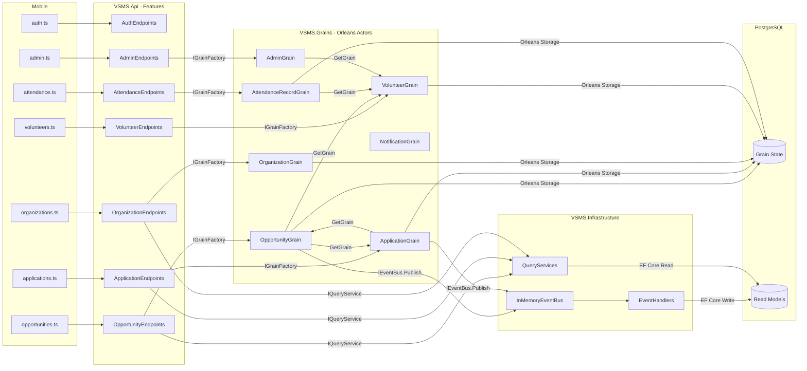

# VSMS System Module Architecture

## Module Call Topology

## Module Descriptions

| Module | Project | Role |
|---|---|---|
| **Mobile Services** | `mobile/services/*.ts` | Axios HTTP clients calling backend REST API |
| **API Endpoints** | `VSMS.Api/Features/*` | Minimal API route handlers, dispatch to Grains or QueryServices |
| **Orleans Grains** | `VSMS.Grains/*Grain.cs` | Domain actors holding state, enforcing business rules |
| **Abstractions** | `VSMS.Abstractions/` | Shared interfaces, DTOs, enums, state classes, grain interfaces |
| **Infrastructure** | `VSMS.Infrastructure/` | EventHandlers, QueryServices, InMemoryEventBus, EF Core DbContext |
| **PostgreSQL** | Runtime | Grain state persistence and CQRS read model storage |

## Key Call Patterns

1. **Command Path**: Mobile Service --> API Endpoint --> Orleans Grain --> Persist State + Publish Event
2. **Query Path**: Mobile Service --> API Endpoint --> QueryService --> EF Core --> PostgreSQL ReadModels
3. **Event Projection**: Grain publishes event --> InMemoryEventBus --> EventHandler --> EF Core upsert to ReadModel
4. **Cross-Grain Calls**: OpportunityGrain calls ApplicationGrain and VolunteerGrain via IGrainFactory
