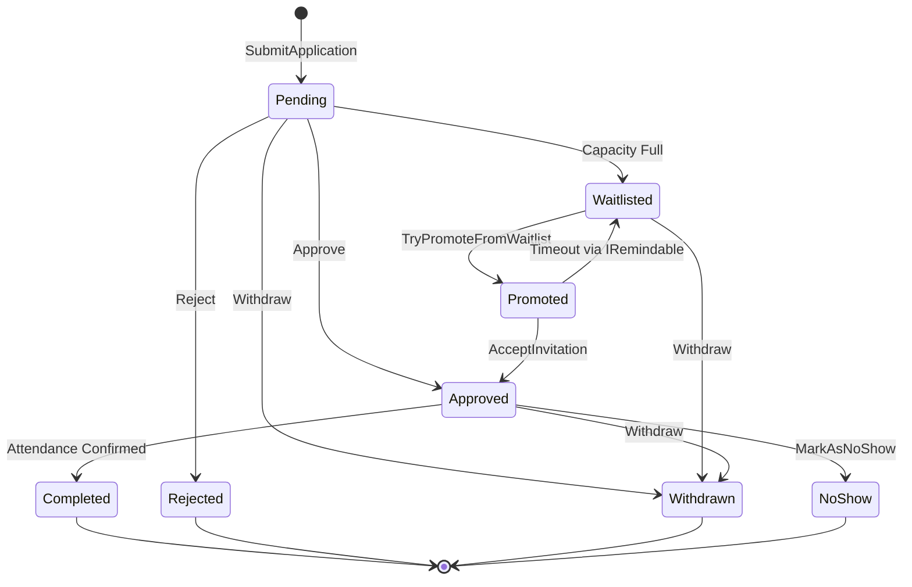
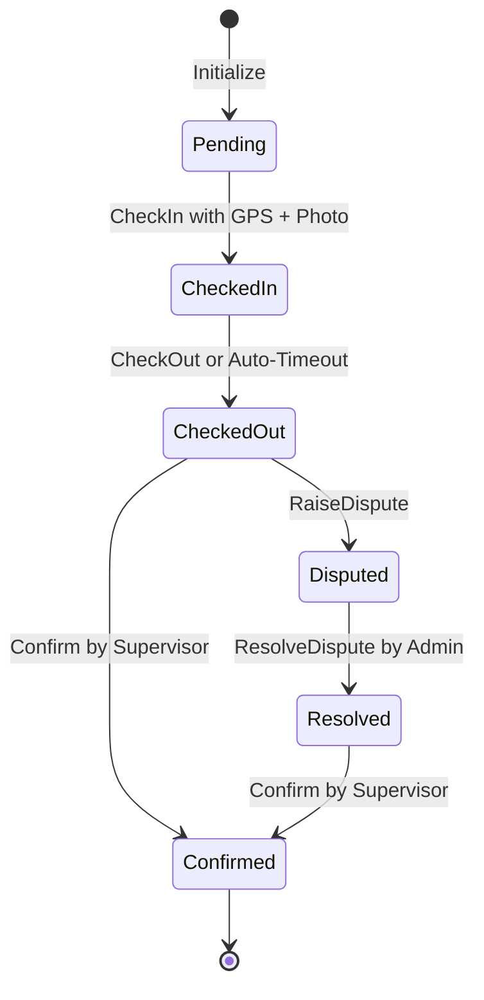
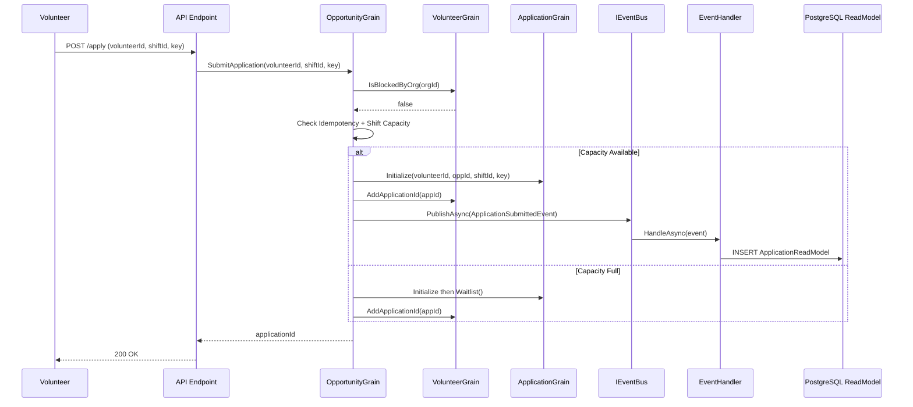
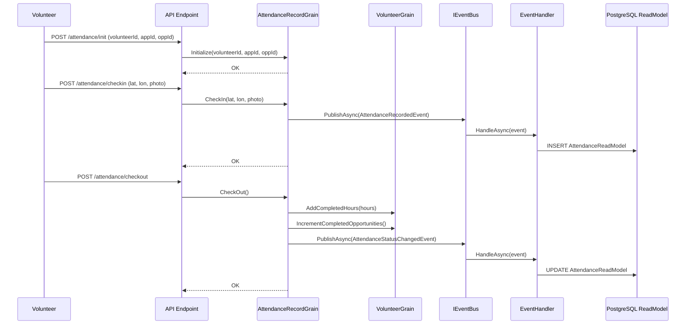

```mermaid
classDiagram
    %% ================= Infrastructure / Base Interfaces =================
    class IGrainWithGuidKey {
        <<interface>>
    }

    class IRemindable {
        <<interface>>
        +ReceiveReminder(reminderName, status) Task
    }

    %% ================= 1. Core Business Grains =================
    IGrainWithGuidKey <|-- IOpportunityGrain
    IGrainWithGuidKey <|-- IApplicationGrain
    IGrainWithGuidKey <|-- IAttendanceRecordGrain
    IGrainWithGuidKey <|-- IVolunteerGrain
    IGrainWithGuidKey <|-- IOrganizationGrain
    IGrainWithGuidKey <|-- IAdminGrain
    IGrainWithGuidKey <|-- INotificationGrain

    IRemindable <|-- OpportunityGrain : "impl only"
    IRemindable <|-- AttendanceRecordGrain : "impl only"
    IRemindable <|-- ApplicationGrain : "impl only"

    class IOpportunityGrain {
        <<Aggregate Root>>
        +Initialize(organizationId, title, desc, category) Task
        +Publish() Task
        +Cancel(reason) Task
        +SubmitApplication(volunteerId, shiftId, idempotencyKey) Task~Guid~
        +WithdrawApplication(appId) Task
        +ValidateGeoLocation(lat, lon) Task~bool~
        +TryPromoteFromWaitlist(shiftId) Task
        +AddShift(name, startTime, endTime, maxCapacity) Task
        +GetState() Task~OpportunityState~ [AlwaysInterleave]
    }

    class IApplicationGrain {
        <<Process Manager>>
        +Initialize(volunteerId, opportunityId, shiftId, idempotencyKey) Task
        +Approve() Task
        +Reject(reason) Task
        +Waitlist() Task
        +Promote() Task
        +Withdraw() Task
        +MarkAsNoShow() Task
        +AcceptInvitation() Task
        +GetState() Task~ApplicationState~
    }

    class IAttendanceRecordGrain {
        <<Proof Entity>>
        +Initialize(volunteerId, applicationId, opportunityId) Task
        +CheckIn(lat, lon, proofPhotoUrl) Task
        +CheckOut(timeOut?) Task
        +ManualAdjustment(coordinatorId, newCheckIn, newCheckOut, reason) Task
        +RaiseDispute(reason, evidenceUrl) Task
        +ResolveDispute(resolverId, resolution, adjustedHours) Task
        +Confirm(supervisorId, rating) Task
        +GetState() Task~AttendanceRecordState~
    }

    class IVolunteerGrain {
        <<User Actor>>
        +GetProfile() Task~VolunteerState~ [AlwaysInterleave]
        +UpdateProfile(firstName, lastName, email, phone, bio) Task
        +UpdatePrivacySettings(isPublic, allowEmail, allowPush) Task
        +UploadCredential(credentialUrl) Task
        +AddApplicationId(applicationId) Task
        +RemoveApplicationId(applicationId) Task
        +GetApplications() Task~List~Guid~~
        +AddCompletedHours(hours) Task
        +IncrementCompletedOpportunities() Task
        +IsBlockedByOrg(orgId) Task~bool~
        +SubmitFeedback(opportunityId, rating, comment) Task
    }

    class IOrganizationGrain {
        <<Tenant Actor>>
        +Initialize(name, desc, creatorUserId, creatorEmail) Task
        +CreateOpportunity(title, desc, category) Task~Guid~
        +InviteMember(email, role) Task
        +BlockVolunteer(volunteerId) Task
        +UnblockVolunteer(volunteerId) Task
        +IsVolunteerBlocked(volunteerId) Task~bool~
        +SetStatus(status) Task
        +GetOpportunities() Task~List~Guid~~
        +GetState() Task~OrganizationState~
    }

    class IAdminGrain {
        <<System Actor>>
        +Initialize(userId) Task
        +ApproveOrganization(orgId) Task
        +RejectOrganization(orgId, reason) Task
        +BanUser(userId) Task
        +UnbanUser(userId) Task
        +ResolveDispute(attendanceId, resolution, adjustedHours) Task
        +GetState() Task~AdminState~
    }

    class INotificationGrain {
        <<Infrastructure Actor>>
        +SendNotification(userId, type, payload) Task
        +SendBulkNotification(userIds, type, payload) Task
        +MarkAsRead(notificationId) Task
    }

    %% ================= 2. Persistent States =================

    class OpportunityState {
        <<GenerateSerializer>>
        +BasicInfo Info
        +List~Shift~ Shifts
        +RecurrenceRule? Recurrence
        +GeoFenceSettings? GeoFence
        +ApprovalPolicy Policy
        +List~Guid~ WaitlistQueue
        +HashSet~Guid~ ConfirmedVolunteerIds
        +List~string~ RequiredSkills
        +OpportunityStatus Status
        +Guid OrganizationId
        +DateTime CreatedAt
    }

    class ApplicationState {
        <<GenerateSerializer>>
        +Guid VolunteerId
        +Guid OpportunityId
        +Guid ShiftId
        +ApplicationStatus Status
        +string IdempotencyKey
        +DateTime? ExpirationTime
        +Dictionary~string, string~ QuestionAnswers
        +DateTime CreatedAt
    }

    class AttendanceRecordState {
        <<GenerateSerializer>>
        +Guid VolunteerId
        +Guid ApplicationId
        +Guid OpportunityId
        +TimeRecord? VerifiedTime
        +GeoFenceSettings? CheckInSnapshot
        +AttendanceStatus Status
        +List~AuditLog~ Modifications
        +DisputeInfo? DisputeLog
        +string ProofPhotoUrl
        +int SupervisorRating
    }

    class VolunteerState {
        <<GenerateSerializer>>
        +string FirstName
        +string LastName
        +string Email
        +string Phone
        +string Bio
        +bool IsProfilePublic
        +bool AllowEmailNotifications
        +bool AllowPushNotifications
        +double ImpactScore
        +double TotalHours
        +int CompletedOpportunities
        +HashSet~Guid~ BlockedByOrgIds
        +List~Guid~ SkillIds
        +List~Guid~ ApplicationIds
        +List~string~ Credentials
        +bool IsInitialized
    }

    class OrganizationState {
        <<GenerateSerializer>>
        +string Name
        +string Description
        +OrgStatus Status
        +List~OrgMember~ Members
        +HashSet~Guid~ BlockedVolunteerIds
        +List~Guid~ OpportunityIds
        +DateTime CreatedAt
        +bool IsInitialized
    }

    class AdminState {
        <<GenerateSerializer>>
        +Guid UserId
        +AdminRole Role
        +List~AuditLog~ ActionLog
        +bool IsInitialized
    }

    %% ================= 3. Enums =================

    class ApplicationStatus {
        <<Enumeration>>
        Pending
        Approved
        Rejected
        Waitlisted
        Promoted
        Withdrawn
        NoShow
        Completed
    }

    class AttendanceStatus {
        <<Enumeration>>
        Pending
        CheckedIn
        CheckedOut
        Disputed
        Resolved
        Confirmed
    }

    class OpportunityStatus {
        <<Enumeration>>
        Draft
        Published
        InProgress
        Completed
        Cancelled
    }

    class OrgStatus {
        <<Enumeration>>
        PendingApproval
        Approved
        Suspended
        Rejected
    }

    class ApprovalPolicy {
        <<Enumeration>>
        AutoApprove
        ManualApprove
        InviteOnly
    }

    class AdminRole {
        <<Enumeration>>
        Moderator
        SuperAdmin
    }

    class OrgRole {
        <<Enumeration>>
        Admin
        Coordinator
        Member
    }

    class DisputeStatus {
        <<Enumeration>>
        Open
        Resolved
    }

    class Frequency {
        <<Enumeration>>
        None
        Daily
        Weekly
        Monthly
    }

    %% ================= 4. Value Objects =================

    class Shift {
        <<Value Object>>
        +Guid ShiftId
        +string Name
        +DateTime StartTime
        +DateTime EndTime
        +int MaxCapacity
        +int CurrentCount
    }

    class RecurrenceRule {
        <<Value Object>>
        +Frequency Type
        +int Interval
        +DateTime? EndDate
    }

    class GeoFenceSettings {
        <<Value Object>>
        +double Latitude
        +double Longitude
        +double RadiusMeters
    }

    class AuditLog {
        <<Value Object>>
        +DateTime Timestamp
        +Guid OperatorId
        +string Action
        +string Reason
    }

    class DisputeInfo {
        <<Value Object>>
        +Guid RaisedByVolunteerId
        +string Reason
        +string EvidenceUrl
        +DisputeStatus Status
        +string Resolution
        +double? AdjustedHours
        +DateTime RaisedAt
        +DateTime? ResolvedAt
    }

    class TimeRecord {
        <<Value Object>>
        +DateTime CheckInTime
        +DateTime? CheckOutTime
        +double TotalHours
    }

    class BasicInfo {
        <<Value Object>>
        +string Title
        +string Description
        +string Category
        +List~string~ Tags
    }

    class OrgMember {
        <<Value Object>>
        +Guid UserId
        +string Email
        +OrgRole Role
        +DateTime JoinedAt
    }

    %% ================= 5. CQRS Read Models =================

    class OpportunitySummary {
        <<EF Core ReadModel>>
        +Guid OpportunityId
        +Guid OrganizationId
        +string OrganizationName
        +string Title
        +string Category
        +OpportunityStatus Status
        +DateTime PublishDate
        +int TotalSpots
        +int AvailableSpots
        +double? Latitude
        +double? Longitude
    }

    class ApplicationSummary {
        <<EF Core ReadModel>>
        +Guid ApplicationId
        +Guid OpportunityId
        +Guid ShiftId
        +string OpportunityTitle
        +string ShiftName
        +DateTime ShiftStartTime
        +DateTime ShiftEndTime
        +Guid VolunteerId
        +string VolunteerName
        +ApplicationStatus Status
        +DateTime AppliedAt
    }

    class AttendanceSummary {
        <<EF Core ReadModel>>
        +Guid AttendanceId
        +Guid OpportunityId
        +Guid VolunteerId
        +string VolunteerName
        +string OpportunityTitle
        +AttendanceStatus Status
        +DateTime? CheckInTime
        +DateTime? CheckOutTime
        +double TotalHours
    }

    class DisputeSummary {
        <<EF Core ReadModel>>
        +Guid AttendanceId
        +Guid VolunteerId
        +string VolunteerName
        +string OpportunityTitle
        +string Reason
        +string EvidenceUrl
        +DateTime RaisedAt
    }

    class OrganizationSummary {
        <<EF Core ReadModel>>
        +Guid OrganizationId
        +string Name
        +string Description
        +OrgStatus Status
        +DateTime CreatedAt
    }

    %% ================= 6. CQRS Query Services =================

    class IOpportunityQueryService {
        <<interface>>
        +SearchPublishedAsync(query?, category?) Task~List~OpportunitySummary~~
        +GetByOrganizationAsync(orgId) Task~List~OpportunitySummary~~
        +GetByIdsAsync(ids) Task~List~OpportunitySummary~~
    }

    class IApplicationQueryService {
        <<interface>>
        +GetByOpportunityAsync(oppId) Task~List~ApplicationSummary~~
        +GetByVolunteerAsync(volId) Task~List~ApplicationSummary~~
        +GetByOrganizationAsync(orgId) Task~List~ApplicationSummary~~
    }

    class IAttendanceQueryService {
        <<interface>>
        +GetByOpportunityAsync(oppId) Task~List~AttendanceSummary~~
        +GetPendingDisputesAsync() Task~List~DisputeSummary~~
    }

    class IOrganizationQueryService {
        <<interface>>
        +GetPendingOrganizationsAsync() Task~List~OrganizationSummary~~
        +GetApprovedOrganizationsAsync() Task~List~OrganizationSummary~~
        +GetOrganizationAsync(orgId) Task~OrganizationSummary?~
    }

    %% ================= 7. Event Bus =================

    class IEventBus {
        <<interface>>
        +PublishAsync~T~(domainEvent) Task
    }

    class IEventHandler~TEvent~ {
        <<interface>>
        +HandleAsync(domainEvent) Task
    }

    %% ================= 8. Relationships =================

    %% State ownership
    IOpportunityGrain *-- OpportunityState : Holds
    IOpportunityGrain *-- Shift : Manages
    IApplicationGrain *-- ApplicationState : Holds
    IAttendanceRecordGrain *-- AttendanceRecordState : Holds
    IVolunteerGrain *-- VolunteerState : Holds
    IOrganizationGrain *-- OrganizationState : Holds
    IAdminGrain *-- AdminState : Holds

    %% Grain interactions
    IOrganizationGrain ..> IOpportunityGrain : "Creates"
    IOpportunityGrain ..> IApplicationGrain : "Manages Lifecycle"
    IOpportunityGrain ..> IVolunteerGrain : "Checks Block Status"
    IApplicationGrain ..> IOpportunityGrain : "Notifies Capacity"
    IAttendanceRecordGrain ..> IVolunteerGrain : "Updates Hours"
    IAdminGrain ..> IOrganizationGrain : "Approves / Rejects"
    IAdminGrain ..> IVolunteerGrain : "Bans / Unbans"

    %% Notification triggers
    IOpportunityGrain ..> INotificationGrain : "Cancel / Reminder"
    IApplicationGrain ..> INotificationGrain : "Status Change"
    IAttendanceRecordGrain ..> INotificationGrain : "Dispute Updates"

    %% CQRS event flow
    IOpportunityGrain ..> IEventBus : "Publishes Events"
    IApplicationGrain ..> IEventBus : "Publishes Events"
    IAttendanceRecordGrain ..> IEventBus : "Publishes Events"
    IOrganizationGrain ..> IEventBus : "Publishes Events"

    IEventBus ..> IEventHandler~TEvent~ : "Routes to"
    IEventHandler~TEvent~ ..> OpportunitySummary : "Upserts"
    IEventHandler~TEvent~ ..> ApplicationSummary : "Upserts"
    IEventHandler~TEvent~ ..> AttendanceSummary : "Upserts"
    IEventHandler~TEvent~ ..> DisputeSummary : "Upserts"
    IEventHandler~TEvent~ ..> OrganizationSummary : "Upserts"

    IOpportunityQueryService ..> OpportunitySummary : "Reads"
    IApplicationQueryService ..> ApplicationSummary : "Reads"
    IAttendanceQueryService ..> AttendanceSummary : "Reads"
    IAttendanceQueryService ..> DisputeSummary : "Reads"
    IOrganizationQueryService ..> OrganizationSummary : "Reads"

    %% Enum usage
    ApplicationState --> ApplicationStatus : uses
    AttendanceRecordState --> AttendanceStatus : uses
    OpportunityState --> OpportunityStatus : uses
    OpportunityState --> ApprovalPolicy : uses
    OrganizationState --> OrgStatus : uses
    DisputeInfo --> DisputeStatus : uses
    OrgMember --> OrgRole : uses
    AdminState --> AdminRole : uses
    RecurrenceRule --> Frequency : uses
```

```mermaid
stateDiagram-v2
    [*] --> Pending : SubmitApplication

    Pending --> Approved : Approve
    Pending --> Rejected : Reject
    Pending --> Waitlisted : Capacity Full
    Pending --> Withdrawn : Withdraw

    Waitlisted --> Promoted : TryPromoteFromWaitlist
    Waitlisted --> Withdrawn : Withdraw

    Promoted --> Approved : AcceptInvitation
    Promoted --> Waitlisted : Timeout via IRemindable

    Approved --> NoShow : MarkAsNoShow
    Approved --> Withdrawn : Withdraw
    Approved --> Completed : Attendance Confirmed

    Completed --> [*]
    Rejected --> [*]
    Withdrawn --> [*]
    NoShow --> [*]
```

```mermaid
stateDiagram-v2
    [*] --> Pending : Initialize

    Pending --> CheckedIn : CheckIn with GPS + Photo

    CheckedIn --> CheckedOut : CheckOut or Auto-Timeout

    CheckedOut --> Disputed : RaiseDispute
    CheckedOut --> Confirmed : Confirm by Supervisor

    Disputed --> Resolved : ResolveDispute by Admin
    Resolved --> Confirmed : Confirm by Supervisor

    Confirmed --> [*]
```

```mermaid
sequenceDiagram
    participant V as Volunteer
    participant API as API Endpoint
    participant OG as OpportunityGrain
    participant VG as VolunteerGrain
    participant AG as ApplicationGrain
    participant EB as IEventBus
    participant EH as EventHandler
    participant DB as PostgreSQL ReadModel

    V->>API: POST /apply (volunteerId, shiftId, key)
    API->>OG: SubmitApplication(volunteerId, shiftId, key)
    OG->>VG: IsBlockedByOrg(orgId)
    VG-->>OG: false
    OG->>OG: Check Idempotency + Shift Capacity

    alt Capacity Available
        OG->>AG: Initialize(volunteerId, oppId, shiftId, key)
        OG->>VG: AddApplicationId(appId)
        OG->>EB: PublishAsync(ApplicationSubmittedEvent)
        EB->>EH: HandleAsync(event)
        EH->>DB: INSERT ApplicationReadModel
    else Capacity Full
        OG->>AG: Initialize then Waitlist()
        OG->>VG: AddApplicationId(appId)
    end

    OG-->>API: applicationId
    API-->>V: 200 OK
```

```mermaid
sequenceDiagram
    participant V as Volunteer
    participant API as API Endpoint
    participant ATT as AttendanceRecordGrain
    participant VG as VolunteerGrain
    participant EB as IEventBus
    participant EH as EventHandler
    participant DB as PostgreSQL ReadModel

    V->>API: POST /attendance/init (volunteerId, appId, oppId)
    API->>ATT: Initialize(volunteerId, appId, oppId)
    ATT-->>API: OK

    V->>API: POST /attendance/checkin (lat, lon, photo)
    API->>ATT: CheckIn(lat, lon, photo)
    ATT->>EB: PublishAsync(AttendanceRecordedEvent)
    EB->>EH: HandleAsync(event)
    EH->>DB: INSERT AttendanceReadModel
    ATT-->>API: OK

    V->>API: POST /attendance/checkout
    API->>ATT: CheckOut()
    ATT->>VG: AddCompletedHours(hours)
    ATT->>VG: IncrementCompletedOpportunities()
    ATT->>EB: PublishAsync(AttendanceStatusChangedEvent)
    EB->>EH: HandleAsync(event)
    EH->>DB: UPDATE AttendanceReadModel
    ATT-->>API: OK
```
