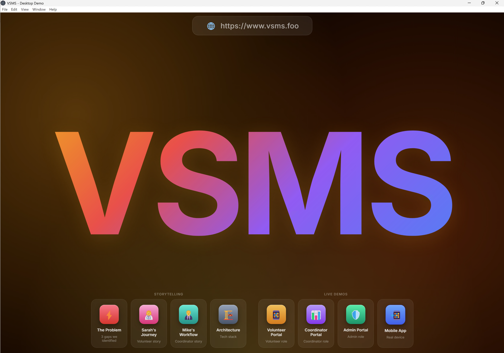
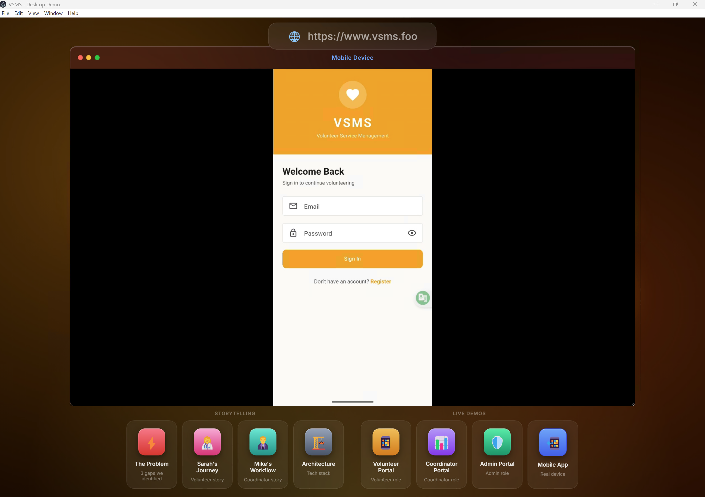

# VSMS Presentation — Interactive Desktop Demo

A cinematic, story-driven presentation engine built with **Electron** for the VSMS (Volunteer Shift Management System) Capstone project. It simulates a macOS-like desktop environment with glassmorphic UI, live web portals, and real Android device screen casting via **scrcpy**.

---

## Features

- **Glassmorphic UI** — Liquid glass windows with native macOS vibrancy and backdrop blur
- **Story-Driven Slides** — Dedicated windows for problem statement, user stories (Sarah & Mike), and architecture overview, enhanced with cartoon illustrations
- **Live Web Demos** — Embedded `<webview>` panels for Volunteer, Coordinator, and Admin portals pointing to the live VSMS site
- **Mobile Device Casting** — Real-time Android screen mirroring via bundled **scrcpy**, captured through Electron's `desktopCapturer` API
- **Cross-Platform** — Runs on macOS (with native vibrancy) and Windows (with dark fallback background)

---

## Screenshots

| Desktop Home | Mobile Device Casting |
|:---:|:---:|
|  |  |

---

## Prerequisites

- **Node.js** ≥ 18
- **npm** ≥ 9
- An Android device with **USB Debugging** enabled (for mobile casting only)

---

## Quick Start (Development)

### 1. Install Dependencies

```bash
cd presentation
npm install
```

### 2. Run in Development Mode

```bash
npm start
```

> Press **ESC** to quit the presentation at any time.

---

## Mobile Casting (scrcpy)

**scrcpy** and **adb** are pre-bundled in the `vendor/` directory for both macOS and Windows — no additional installation required.

To use the mobile casting feature:
1. Connect your Android device via USB
2. Enable **USB Debugging** on the device
3. Click the **📲 Mobile App** card in the presentation

---

## Packaging for Distribution

### Install Build Tools

```bash
npm install --save-dev electron-builder
```

### Build for macOS

```bash
# Apple Silicon (M1/M2/M3/M4)
npm run build:mac

# Output: dist/mac-arm64-unpacked/
# → Double-click "VSMS Presentation.app" to run
```

### Build for Windows

```bash
# x64 (most Windows PCs)
npm run build:win

# Output: dist/win-unpacked/
# → Double-click "VSMS Presentation.exe" to run
```

### Build for Both Platforms

```bash
npm run build:all
```

> **Note:** Cross-compilation from macOS to Windows works out of the box with electron-builder. The `vendor/win/` scrcpy binaries are automatically included via `extraResources` in `package.json`.

### Build Output Structure

```
dist/
├── win-unpacked/                     ← Windows x64 portable app
│   ├── VSMS Presentation.exe        ← Main executable (~160 MB)
│   ├── resources/
│   │   ├── app.asar                  ← Bundled app code + assets
│   │   └── vendor/                   ← Bundled scrcpy binaries
│   │       ├── mac/
│   │       └── win/
│   └── ...                           ← Electron runtime files
└── mac-arm64-unpacked/               ← macOS portable app
    └── VSMS Presentation.app
```

---

## Usage Guide

### Desktop Layout

The presentation desktop has two groups of cards at the bottom:

| Group | Cards | Description |
|-------|-------|-------------|
| **Storytelling** | ⚡ The Problem, 👩‍⚕️ Sarah, 👨‍💼 Mike, 🏗️ Architecture | Narrative HTML slides |
| **Live Demos** | 📱 Volunteer Portal, 📊 Coordinator, 🛡️ Admin, 📲 Mobile App | Live webviews + device cast |

### Mobile Casting Workflow

1. Connect your Android device via USB cable
2. Enable **USB Debugging** on the device
3. Click the **📲 Mobile App** card
4. The app will:
   - Launch scrcpy in the background
   - Capture the device screen via `desktopCapturer`
   - Display it inside the Mobile App window

### Keyboard Shortcuts

| Key | Action |
|-----|--------|
| `ESC` | Quit the presentation |
| `Cmd+R` / `Ctrl+R` | Reload the presentation |

---

## Project Structure

```
presentation/
├── main.js              ← Electron main process (window, IPC, scrcpy management)
├── index.html           ← All windows and slide content
├── package.json         ← Scripts and electron-builder configuration
├── assets/
│   ├── style.css        ← Liquid Glass design system
│   ├── script.js        ← Window management, drag, minimize, video capture
│   └── images/          ← Cartoon illustrations for storytelling slides
├── vendor/
│   ├── mac/             ← macOS scrcpy binary
│   └── win/             ← Windows scrcpy binary + adb
└── dist/                ← Build output (generated)
```

---

## Troubleshooting

### macOS: "Screen Recording" Permission

On first launch, macOS may prompt for Screen Recording permission. Grant it to **Electron** (or **VSMS Presentation** if packaged) in:
**System Settings → Privacy & Security → Screen Recording**

### Windows: No Window Appears

Ensure you're using the latest packaged build. Older builds may crash silently due to read-only filesystem issues in the bundled app.

### Mobile Casting: Black Screen

1. Verify the device is connected: `adb devices`
2. Ensure USB Debugging is enabled
3. Try unplugging and re-plugging the USB cable
4. Check terminal logs for `[DesktopCapturer]` output

---

## Tech Stack

- **Electron** 29 — Cross-platform desktop runtime
- **HTML5 / CSS3** — Glassmorphism, backdrop-filter, CSS Grid
- **Vanilla JavaScript** — Window management, IPC communication
- **scrcpy** 3.3.4 — Android screen mirroring
- **electron-builder** — Cross-platform packaging

---

## License

This project is part of the VSMS Capstone for Conestoga College PROG8950.
