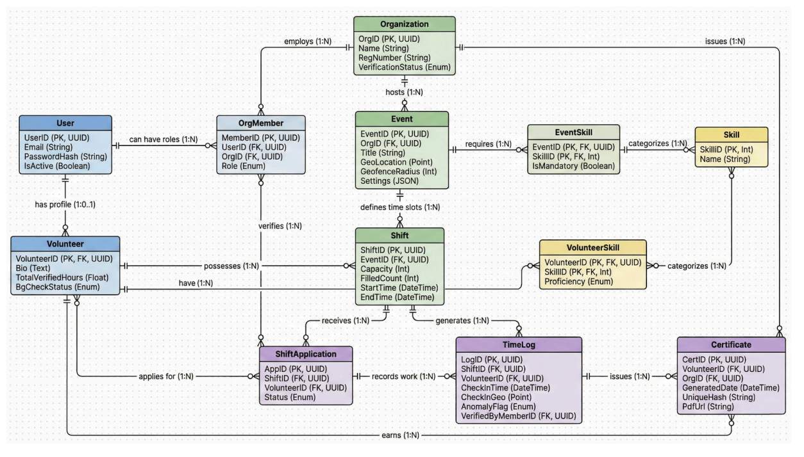

# CAD-Capstone
# VSMS: Volunteer Service Management System

<div align="center">


**A platform for revolutionizing volunteer management through automated verification and compliance.**

[Features](#-features) • [Tech Stack](#-tech-stack) • [Getting Started](#-getting-started) • [Documentation](#-documentation) • 

</div>

---

## 📖 Table of Contents

- [The Problem](#-the-problem)
- [Our Solution](#-our-solution)
- [Key Features](#-key-features)
- [Tech Stack](#-tech-stack)
- [Architecture](#-architecture)
- [Getting Started](#-getting-started)
- [Project Structure](#-project-structure)
- [Development Workflow](#-development-workflow)
- [Testing](#-testing)
- [Deployment](#-deployment)
- [Team](#-team)
- [License](#-license)

---

## 🎯 The Problem

Volunteer coordination in Ontario faces four critical challenges:

### 1. 📧 Email Overload
Coordinators spend **15+ hours weekly** managing scheduling emails with zero visibility into who's already signed up.

### 2. ⏰ Lost Hours
Paper sign-in sheets and manual tracking lead to forgotten check-ins and **lost volunteer hours that can't be recovered** for graduation or certification requirements.

### 3. 📄 Proof Problems
Students need **40 hours for Ontario graduation** (or **120-150 hours for PSW diplomas**) but chase signatures for weeks to get official documentation.

### 4. 😰 Last-Minute Hour Panic
Students can't see in real-time how many approved clinical hours they still need before program deadlines.

---

## 💡 Our Solution

A **mobile-first , web platform** that automates volunteer coordination with GPS-verified attendance, instant certificates, and real-time progress tracking.

### For Volunteers 🙋
- 📍 **Smart Discovery**: Location-based matching finds opportunities within 5 km
- ✅ **Auto Check-in**: Geofencing triggers arrival notifications automatically
- 🎓 **One-Click Proof**: Generate verified certificates instantly for schools/employers
- 📊 **Skill Tracking**: Build a professional portfolio across all organizations

### For Organizations - Coordinator 🏢
- 📧 **Zero Email**: Automated scheduling with real-time availability
-  **Predictive Demand Forecasting** :AI-Driven Predictive Demand Forecasting 
- 📱 **Digital Attendance**: GPS-verified check-ins eliminate manual tracking
- 📈 **Instant Reports**: Export verified hours for grant compliance
- 🛡️ **Fraud Prevention**: Geofencing ensures volunteers are actually present

---

## ✨ Key Features

### MVP - Core Functionality

#### Volunteers 
| Feature | Description | Status |
|---------|-------------|--------|
| **Multi-org Discovery** | Browse opportunities across organizations with map view | 📋 Planned  |
| **Application Tracking** | Real-time status updates (pending/approved/rejected) | 📋 Planned |
| **Document Upload** | Secure upload for background checks, certifications | 📋 Planned |
| **Smart Task Discovery** | Location-based matching within 5 km radius | 📋 Planned |
| **One-Click Application** | Auto-approval based on task capacity | 📋 Planned |
| **Geofenced Check-in** | Automatic GPS-verified attendance tracking | 📋 Planned |
| **Progress Dashboard** | Visual tracking toward graduation/certification goals | 📋 Planned |
| **Certificate Generator** | Instant verified PDFs for schools/employers | 📋 Planned |

#### Coordinators 
| Feature | Description | Status |
|---------|-------------|--------|
| **Organization Verification** | Upload proof of legitimate organization | 📋 Planned |
| **Attendance Console** | Live dashboard with geofence validation | 📋 Planned |
| **Shift Management** | Create/manage shifts with real-time applicants | 📋 Planned |
| **Approval Workflow** | Review applications and verify credentials | 📋 Planned |
| **Geofencing Config** | Set radius boundaries for each location | 📋 Planned |
| **Bulk Notifications** | Send automated shift reminders/updates | 📋 Planned |
| **Organization Profile** | Manage details, locations, requirements | 📋 Planned |
| **Predictive Demand Forecasting**| A heatmap or trend line showing "Predicted Need" vs. "Current Registered Volunteers."| 📋 Planned |

📌 **Note**: See [ROADMAP.md](https://github.com/users/czhang1818/projects/4/views/1) for Tier 2 & 3 features (notifications, analytics, AI forecasting)

---

## 🛠️ Tech Stack

### Frontend (Mobile)
- TBD

### Backend
- TBD

### Infrastructure
- TBD

### Development Tools
- TBD

---

## 🏗️ Architecture

- TBD


### Database Schema

See detailed schema with relationships in 


---

## 🚀 Getting Started

### Prerequisites
- TBD
- **Node.js** >= 18.0.0 ([Download](https://nodejs.org/))
- **npm** >= 9.0.0 or **yarn** >= 1.22.0
- **PostgreSQL** >= 15.0 ([Download](https://www.postgresql.org/download/))
- **Expo CLI** (install globally: `npm install -g expo-cli`)
- **Git** ([Download](https://git-scm.com/))

**For mobile development:**
- TBD
- **Expo Go** app on your phone ([iOS](https://apps.apple.com/app/expo-go/id982107779) | [Android](https://play.google.com/store/apps/details?id=host.exp.exponent))
- OR **iOS Simulator** (macOS only) / **Android Emulator**


---

## 📁 Project Structure

- TBD
```
volunteer-management-system/
├── .github/                    # GitHub Actions, issue templates, PR templates
├── docs/                       # All project documentation
│   ├── architecture/           # System design, diagrams, ADRs

```

> 📚 See [ARCHITECTURE.md](./docs/architecture/system-overview.md) for detailed component descriptions

---

## 💻 Development Workflow

### Branch Strategy

We follow **Git Flow**:

- `main` - Production-ready code
- `develop` - Integration branch for features
- `feature/*` - New features (e.g., `feature/V-9-geofenced-checkin`)
- `bugfix/*` - Bug fixes
- `hotfix/*` - Critical production fixes

### Commit Convention

We use [Conventional Commits](https://www.conventionalcommits.org/):
```bash
feat(mobile): add geofenced check-in screen
feat(frontend): add dashboard check-in screen
fix(backend): resolve authentication token expiry bug
docs(readme): update setup instructions
test(backend): add unit tests for shift service
chore(deps): update dependencies
```

### Pull Request Process

1. Create a feature branch from `develop`
2. Make your changes and commit
3. Push and create a Pull Request
4. Ensure CI checks pass (linting, tests)
5. Get at least 1 approval from a team member
6. Squash and merge into `develop`


---

## 🧪 Testing

### Running Tests

- TBD
```bash
# Backend tests
cd backend
npm test                    # Run all tests
npm run test:unit          # Unit tests only
npm run test:integration   # Integration tests
npm run test:e2e           # End-to-end tests
npm run test:coverage      # Generate coverage report

# Mobile tests
cd mobile
npm test                    # Jest tests
npm run test:e2e           # Detox E2E tests (requires simulator)
```

### Test Coverage Goals

- **Unit Tests**: > 80% coverage
- **Integration Tests**: All API endpoints
- **E2E Tests**: Critical user flows (check-in, application, certificate generation)

---

## 🚢 Deployment

### Environments

- **Development**: Local development environment
- **Staging**: Testing environment (mimics production)
- **Production**: Live application (TBD)

### Backend Deployment
- TBD

### Mobile Deployment
- TBD


## 👥 Team

### Development Team

- Bo Yang
- Bo Zhang
- Chunxi Zhang
- Marieth Franciss Perez Zevallos


---

## 📄 License

This project is licensed under the MIT License - see the [LICENSE](./LICENSE) file for details.
